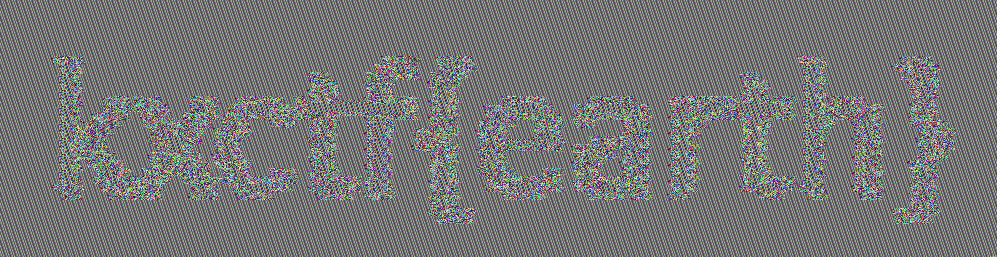

Описание файлов.
Aes.cpp - реализация алгоритма шифрования для компиляции и шифрования файла с данными
ConvertJpegToData.py - программа для сохранения картинки в виде файла с байтами.
На каждый пиксель исходной картинки уходит 3 байта цвета. Все пиксели записаны последовательны
слева на право, сверху вниз.
Data - файл с закодированной картинкой
Data.enc - файл с закодированной и зашифрованной картинкой
FindPictureSize.py - скрипт для генерации длины и ширины картинки, при котором 
количество байт картинки будет иметь 1 как остаток от деления на 16. 
Т.е ширина * длина * 3(количество байт на пиксель) % 16 = 1. Это нужно для определения размера исходной
картинки игроком
ReadMe.txt - файл с описанием папки
Result.png - картинка с результатом шифрования
Solution.png - скрипт для загрузки данных из Data.enc и демонстрации полученного результата
Task.jpeg - исходная картинка

Решение задачи:
1. В задании есть намек на графическое изображение, следовательно игрок может предположить что это картинка
2. Так как AES использует паддинг, то в файле, предоставленном игроку, находится лишняя информация.
Паддинг может быть от 1 до 15. Игрок должен начать перебирать длину паддинга
3. При паддинге равном 1, т.е когда исходный файл всего на 1 байт меньше зашифрованного игрок
должен разделить это число на 3, а после чего найти все делители этого числа. Делителями числа будет 2 простых числа,
а значит они и есть длина и ширина.
4. Дальше осталось только написать программу для отображения картинки.

Пример: зашифрованные данные весят 768688 байт. 
Начинаем перебирать паддинг: паддинг равен 1, тогда исходная картинка весит 768687 байт.
Делим на 3 и получаем 256 229 байт. Найдем делители этого числа: 1,  257,  997,  256 229.
Очевидно, что 257 и 997 и есть размеры исходного изображения.

Флаг: kxctf{earth}

