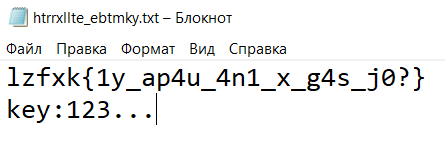
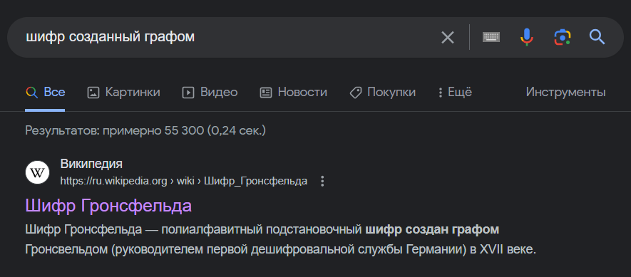
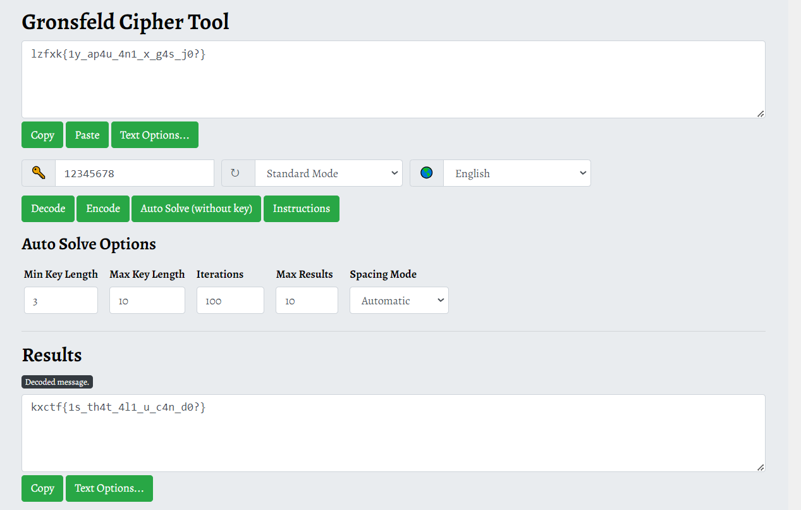

Открываем текстовый файл.

Опираясь на описание таска начинаем искать шифры.

Далее заходим на любой сайт с этим шифром.
И подбираем ключ, так как в файле нам дан `123...` то очевидно будет продолжить добавлять цифры по порядку.
Таким образом получаем `key: 12345678`, вводим его и получаем флаг.

