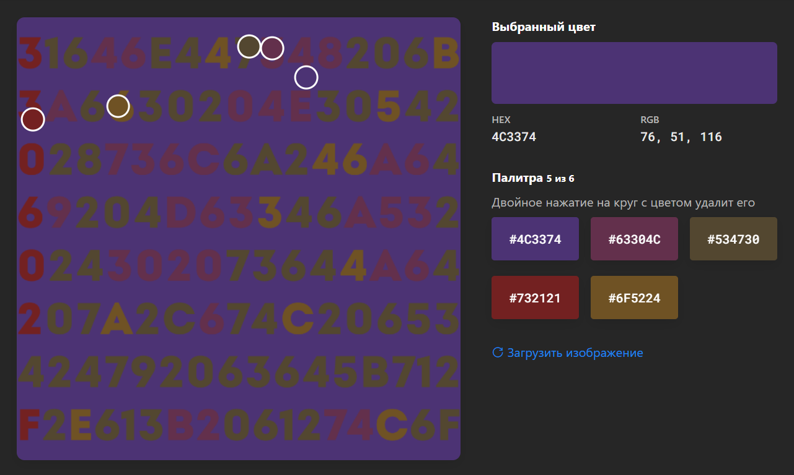

На картинке есть 5 цветов. У каждого цвета есть свой код в HEX. Они определяются однозначно по пикселю:

Получаются такие коды: 4c3374 63304c 534730 732121 6f5224. 
Для решения осталось расположить их в верном порядке. Для этого надо пойти от большего наличия цвета на картинке к меньшему. Фона (4c3374) больше всего. Дальше достаточно посчитать, сколько есть букв какого цвета. 
Получается следующий порядок: 4c3374 534730 63304c 6f5224 732121. 
Переводя в классический Hex (необязательно конечно, но для полноты): 4c 33 74 53 47 30 63 30 4c 6f 52 24 73 21 21, что в дешифровке будет `L3tSG0c0LoR$s!!`

Оборачиваем его и получаем флаг kxctf{L3tSG0c0LoR$s!!}