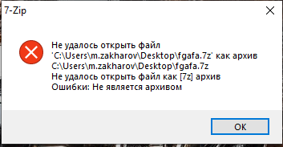
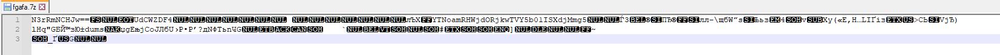
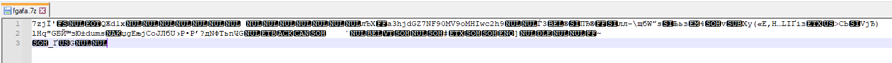
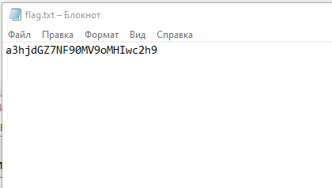
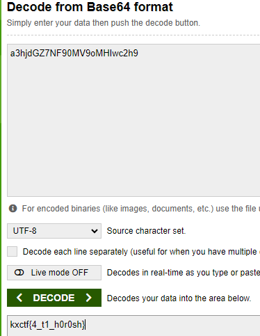

Пытаемся открыть архив, видим ошибку:

Открываем его в Notepad++:

Видим, что часть данных архива представлена в base64 -> приведем ее в нормальный вид:

После этого архив откроется и в нем лежит flag.txt -> открываем:

Снова видим base64 -> декодируем -> получаем флаг:

