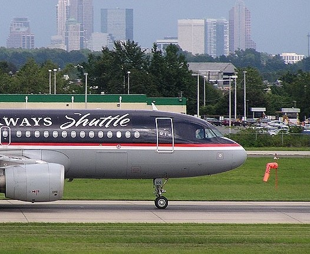

# In search of a miracle/В поисках чудa

## Задача:
Мне нужны все данные c последнего рейса. Номер, аэропорт вылета и координаты (Точность 3 знака)

Формат флага: kxctf{flight_IATA_latitude_longitude}

## РешениЯ:
### Дисклеймер: это авторские способы решения. Ваши варианты, методы и источники могут отличаться!
## Способ 1:

Для начала, извлечем всю возможную информацию  из изображения об этом воздушном судне. Стандартная процедура поиска фото в браузере позволяет определить тип самолета и авиакомпанию - 
Airbus A320 авиакомпании US Airways Shuttle. 

Так как парк авиакомпании может включать n-ое количество подобных аэробусов - среди источников необходимо найти тот, который позволит искать самолет по определенным фильтрам. 
В данном случае использовался JetPhotos. С помощью расширенного 
поиска (Aircraft: A320 | Airline:  US Airways Shuttle) легко находится оригинальное изображение, а также становится доступна вся информация о борте. 

Внимательно изучаем страницу!!!

!!! Comments: Ditched into the Hudson River in New York City on 15 January 2009 after a dual engine failure caused by multiple bird strikes. !!!

Теперь известно, что, где и когда с ним произошло. Запрос "аварийная посадка на Гудзон" сразу же выдает ссылку на статью в википедии, откуда получаем:

Рейс: AWE1549 
Аэропорт вылета: Ла-Гуардия (LGA)

Пролистав чуть ниже до блока "Приводнение и эвакуция" получаем координаты аварии

Округляем до 3 цифр после точки и не забываем про знак!

Результат: kxctf{AWE1549_LGA_40.769_-74.004}

## Способ 2 (для любителей стеги и шизы)

Если вам лень или сложно искать изображение в Google, можно проверить изображение на наличие txt файлика с помощью Steghide. Кодовая фраза может быть получена с помощью Stegcracker'а и rockyou.txt или десятизначного IQ.

Кодовая фраза: airbus

Зашифрованный текст в кодировке base64 содержит ссылку на актера Тома Хэнкса. 

Дальше по отработанной схеме с Википедией получаем флаг.
