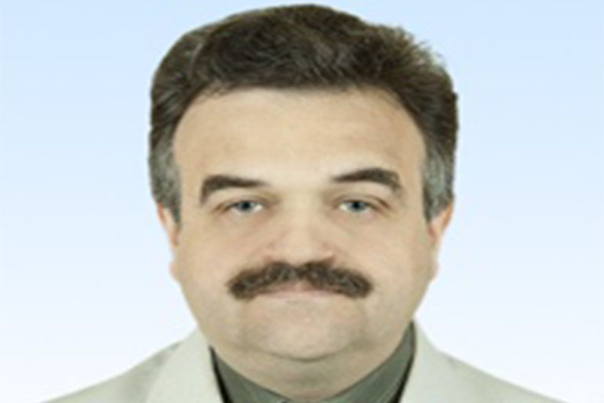

По словам "так называемый" в названии, и МП "Экос" в описании выходим на ["Игоря Гофмана"](https://memepedia.ru/igor-gofman-7-8/) и его [Блог в Интернете](https://www.youtube.com/@gofman39)

Для того чтобы найти что за человек изображен на фото в задании нужно произвести изучение канала данного персонажа, и используя наитие понять, что речь о человеке с картинки идет в видео ["Одисситочка Я Рая на Чечерина живу" 15:53](https://youtu.be/vTGu3Y652oc?t=953). "Охранник Дзержинского участник штурма Зимнего и так далее, зовут его Матвей Гофман". Получаем флаг: kxctf {Gofman_Matvey}