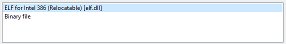
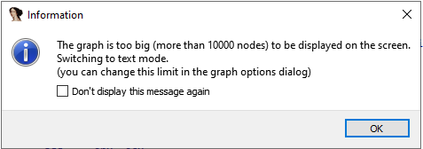
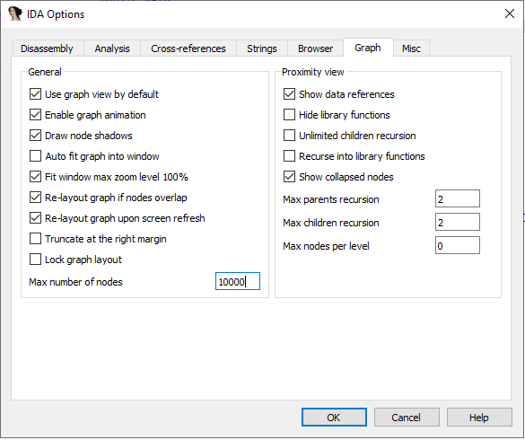
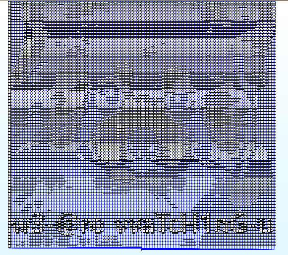
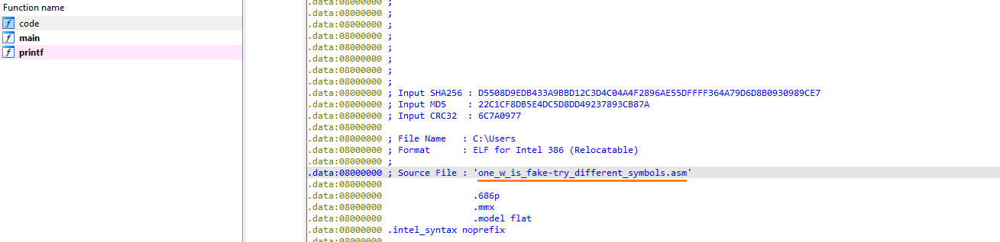

- Открываем файл в IDA;
- Выбираем "ELF for Intel 386";

- При попытке представить код в виде графов может появиться следующее сообщение:

- Идём в *Options*->*General*->*Graph*, в поле *Max number of nodes* ставим значение побольше. Например, 100000:
    

- Переходим в *main*, который откроется в графовом представлении. Отдаляемся с помощью колёсика мыши с зажатым *Ctrl*. Флаг найден, оборачиваем в шаблон:

**kxctf{w3-@re_vvaTcH1nG-u}**

P.S. Во вкладке *code* есть подсказка, связанная со вторым символом "w" в флаге:

