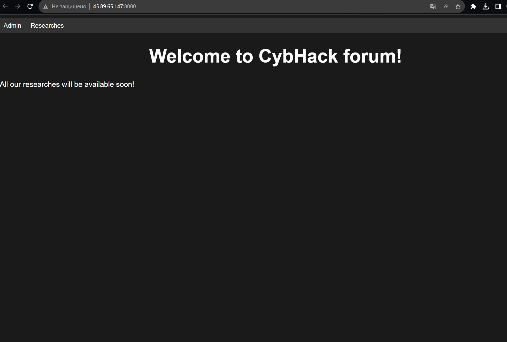
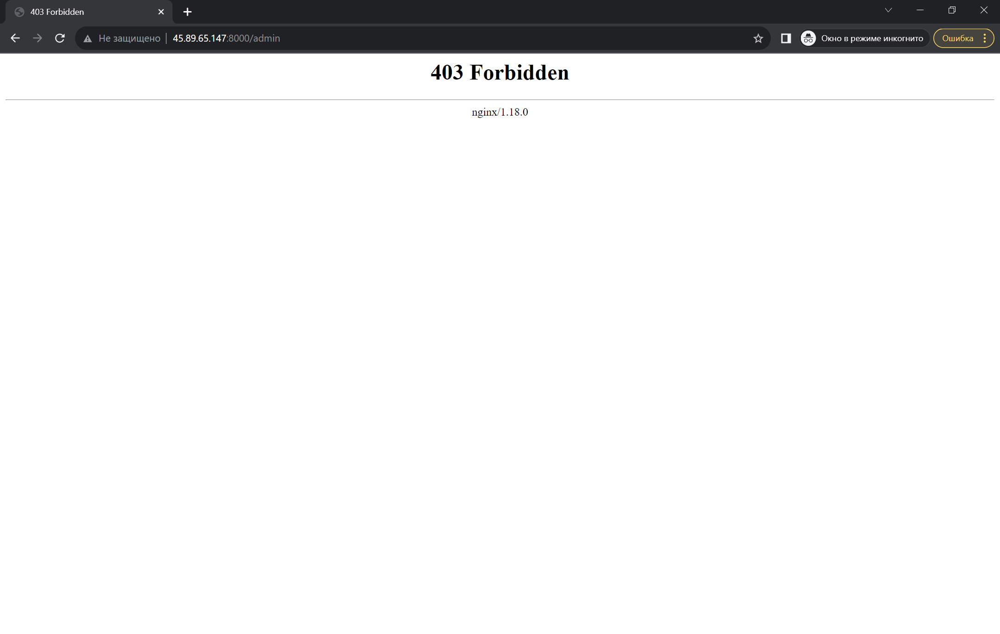
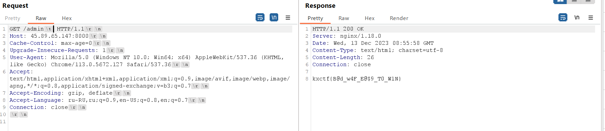

# Bad waf
## Описание
Наша команда создала форум на котором будут выходить статьи и наши ресерчи. Пока мы временно ограничили доступ к некоторым страницам, получится ли у вас обойти эту блокировку?

## Writeup
- Переходим на `http://45.89.65.147:8000/` и видим страницу форума

- При переходе на страницу /admin, nginx 18.0.0 отдает 403

- Для обхода седует передать символы юникода, которые при передаче вместе с /admin будут восприниматься nginx-ом как другая строка (!= /admin), и nginx пропустит их дальше, а Flask не будет учитывать эти символы и отдаст страницу admin. Вот список этих символов в юникоде (`\x85, \xA0, \x1F, \x1E, \x1D, \x1C, \x0C, \x0B`)

 
## Флаг 
`kxctf{B@d_w4F_E@$9_T0_W1N}`
