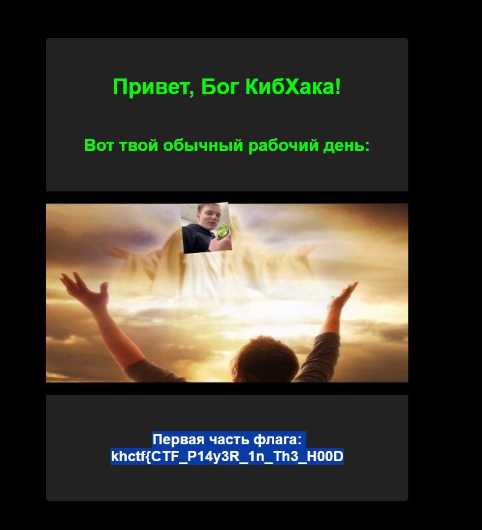

# CybHack God 

## Описание 
Твоя психика, кажется, уже слишком расшатана((( Пора бы разобраться в себе и сходить на прием к богу КибХака! А вот это поможет вам найти общий язык: (тут архив с сорцами)

## Райтапчик 
Килчейн состоит из двух вулн.
- Хуевый распарс json'а в структуру
- Неявная скуля в gorm

### Первая вулна
Приложение представляло из себя сервис авторизации. Авторизация происходила по jwt токенам. Была подозрительная функциия генерации соли:

```golang
func CreateSult() {
	rawSaultJSON := []byte(fmt.Sprintf("{\"seed_time\":%.f}", math.Pow(float64(time.Now().Unix()), float64(time.Now().Day()%2+3))))
	os.WriteFile("etc/sult.json", rawSaultJSON, 0644)
}
```

Кто-то мог начать брутить соль с учетом времени, однако это рэбит хол. После генерации, как мы видим, секрет записывается в json file. Чтобы достать секрет из файла используется структура `JWTRandomSeed` и фуночка `GetJWTSecret`, в которых и кроется уязвимость:

```golang
type JWTRandomSeed struct {
	Seed_time int
}

func GetJWTSecret() []byte {
	raw_json_sult, err := os.ReadFile("etc/sult.json")
	if err != nil {
		log.Fatal("No file")
	}

	var jwt_sult JWTRandomSeed

	json.Unmarshal(raw_json_sult, &jwt_sult)

	return []byte(strconv.Itoa(jwt_sult.Seed_time))

}
```

После того, как пролижуха читает содержимое файла, она парсит его функцией `Unmarshal`. Та в свою очередь возвращает ошибку, которую из кода мы никак не обрабатывем. Число в файле слишком большое для переменной типа int, однако мы это никак не учитываем, пэтому в объекте `jwt_sult` остается `nil` в поле `Seed_time`. Соотведственно значение секрета при подписывании токенов будет `"0"`.
Поздравляю, теперь мы можем переподписывать тогены.

### Вторая вулна

Очевидно, если флаг лежит в базе и до него нет доступа из логики приложения, значит, базу надо как-то сдампить. Учтем и тот факт, что мы уже научились переподписывать токены. Значит, стоит проверить все места использования токена на предмет скулей.
Немного поресерчив, как работает gorm, и почитав код, вы могли наткнуться на проверку валидности токена для админки на ручке `/admin`. Вот так она выглядела:

```golang 
func (s *Server) admin(c echo.Context) error {
	cookie, err := c.Cookie("AuthToken")

	if err != nil {
		return c.Redirect(http.StatusFound, "/login")
	}

	json, jwterr := jwt.DecodeJWT(cookie.Value)

	if jwterr != nil {
		cookie := new(http.Cookie)
		cookie.Name = "AuthToken"
		cookie.Value = ""

		c.SetCookie(cookie)
		return c.Redirect(http.StatusFound, "/login")
	}

	user := new(models.User)
	// Вот тут чет интересное
	s.orm.DB.First(user, json["id"])

	if !user.IsAdmin {
		return c.Redirect(http.StatusFound, "/profile")
	}

	return c.Render(http.StatusOK, "admin.html", map[string]interface{}{
		"flag_part_one": s.config.Flag.FirstPart,
	})
}
```
Во-первых, стоит начать с того, что функция `First` уязвима ([Тут можете почитать](https://gorm.io/docs/security.html)). К этому добавляется неопределенность типов при работе с мапой (json["id"] является интерфейсом, а не `int`), поэтому мы можем переделать тип поля `id` в jwt-токене на `string`, после чего появляется возможность эксплойтить скулю прямо из jwt. Токен будет выглядеть вот так:
```json
{"alg": "HS256", "typ": "JWT"}.{"id": "is_admin=true"}.blablabla
```
С помощью такой конструкции можем взять первую часть флага. 
Конечно же, все ждали мемов в админке, поэтому для тех, кто до нее не дошел, приклыдываю)))



Для взятия второй части флага можем доработать вышеописанный токен и начать эксплуатировать bool-based скулю (Прикладываю рабочий сплойт в соседнем фале.-.)

Надеюсь, что вам понравилась тасочка<З

Powered by [FrakenboK](https://ctftime.org/user/94195) ([@helloworlddlrowolleh](https://t.me/helloworlddlrowolleh))